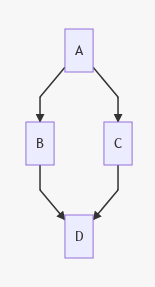

# Flowcharts Plugin for DokuWiki
Add flowcharts and diagrams to Dokuwiki with an intuitive syntax

The diagrams and flowcharts are generated with https://mermaidjs.github.io/. 

# Syntax

```
<flow>
graph TD;
    A-->B;
    A-->C;
    B-->D;
    C-->D;
</flow>
```

will be rendered to




For further details on the syntax, see https://mermaidjs.github.io/.

If you install this plugin manually, make sure it is installed in
lib/plugins/mermaidflowcharts/ - if the folder is called different it
will not work!

Please refer to http://www.dokuwiki.org/plugins for additional info
on how to install plugins in DokuWiki.

----
Copyright (C) Jakob Schwichtenberg <mail@jakobschwichtenberg.com>

This program is free software; you can redistribute it and/or modify
it under the terms of the GNU General Public License as published by
the Free Software Foundation; version 2 of the License

This program is distributed in the hope that it will be useful,
but WITHOUT ANY WARRANTY; without even the implied warranty of
MERCHANTABILITY or FITNESS FOR A PARTICULAR PURPOSE.  See the
GNU General Public License for more details.

See the LICENSING file for details
